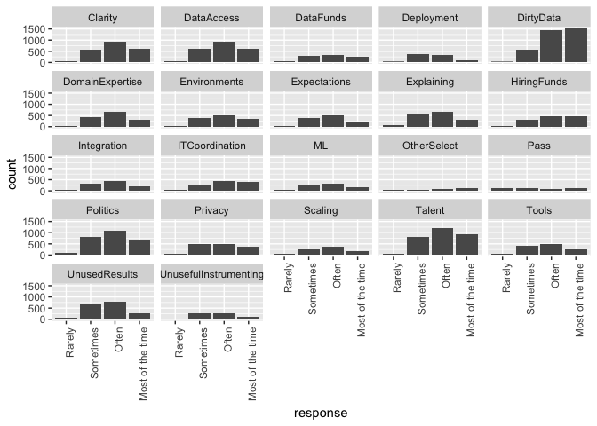
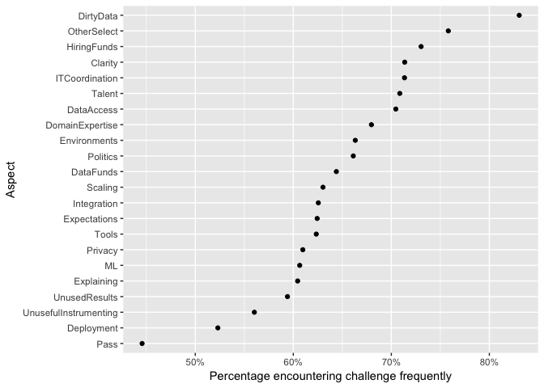

## Reading in the data

We'll try the base R way first. 


```r
multiple_choice_responses_base <- read.csv("multipleChoiceResponses.csv")
# multiple_choice_responses_base
```

Let's say we wanted to know the numbers of NAs in each column. We can use `is.na` to change each entry in a column to TRUE or FALSE, depending on whether it's NA, and then sum the column (because `TRUE` evaluates as 1 and `FALSE` as 0) to get the total number of NAs. 

To do this for every column, we can use `purrr::map_df`, which applies the given function over the whole dataset, column by column, and returns a dataframe with the same column names and one row representing the number of NAs in each column. If you're used to the `apply` family of functions, `purrr` offers the same capabilities in a more consistent way. The `_df` part of the function represents what we want back (a dataframe); using `map` would get us a list. 


```r
# for one column
sum(is.na(multiple_choice_responses_base$Country))
```

```
## [1] 0
```

```r
# for every column 
multiple_choice_responses_base %>%
  purrr::map_df(~sum(is.na(.)))
```

```
## # A tibble: 1 x 228
##   GenderSelect Country   Age EmploymentStatus StudentStatus
##          <int>   <int> <int>            <int>         <int>
## 1            0       0   331                0             0
## # ... with 223 more variables: LearningDataScience <int>,
## #   CodeWriter <int>, CareerSwitcher <int>, CurrentJobTitleSelect <int>,
## #   TitleFit <int>, CurrentEmployerType <int>, MLToolNextYearSelect <int>,
## #   MLMethodNextYearSelect <int>, LanguageRecommendationSelect <int>,
## #   PublicDatasetsSelect <int>, LearningPlatformSelect <int>,
## #   LearningPlatformUsefulnessArxiv <int>,
## #   LearningPlatformUsefulnessBlogs <int>,
## #   LearningPlatformUsefulnessCollege <int>,
## #   LearningPlatformUsefulnessCompany <int>,
## #   LearningPlatformUsefulnessConferences <int>,
## #   LearningPlatformUsefulnessFriends <int>,
## #   LearningPlatformUsefulnessKaggle <int>,
## #   LearningPlatformUsefulnessNewsletters <int>,
## #   LearningPlatformUsefulnessCommunities <int>,
## #   LearningPlatformUsefulnessDocumentation <int>,
## #   LearningPlatformUsefulnessCourses <int>,
## #   LearningPlatformUsefulnessProjects <int>,
## #   LearningPlatformUsefulnessPodcasts <int>,
## #   LearningPlatformUsefulnessSO <int>,
## #   LearningPlatformUsefulnessTextbook <int>,
## #   LearningPlatformUsefulnessTradeBook <int>,
## #   LearningPlatformUsefulnessTutoring <int>,
## #   LearningPlatformUsefulnessYouTube <int>,
## #   BlogsPodcastsNewslettersSelect <int>, LearningDataScienceTime <int>,
## #   JobSkillImportanceBigData <int>, JobSkillImportanceDegree <int>,
## #   JobSkillImportanceStats <int>,
## #   JobSkillImportanceEnterpriseTools <int>,
## #   JobSkillImportancePython <int>, JobSkillImportanceR <int>,
## #   JobSkillImportanceSQL <int>, JobSkillImportanceKaggleRanking <int>,
## #   JobSkillImportanceMOOC <int>, JobSkillImportanceVisualizations <int>,
## #   JobSkillImportanceOtherSelect1 <int>,
## #   JobSkillImportanceOtherSelect2 <int>,
## #   JobSkillImportanceOtherSelect3 <int>, CoursePlatformSelect <int>,
## #   HardwarePersonalProjectsSelect <int>, TimeSpentStudying <int>,
## #   ProveKnowledgeSelect <int>, DataScienceIdentitySelect <int>,
## #   FormalEducation <int>, MajorSelect <int>, Tenure <int>,
## #   PastJobTitlesSelect <int>, FirstTrainingSelect <int>,
## #   LearningCategorySelftTaught <int>,
## #   LearningCategoryOnlineCourses <int>, LearningCategoryWork <int>,
## #   LearningCategoryUniversity <int>, LearningCategoryKaggle <int>,
## #   LearningCategoryOther <int>, MLSkillsSelect <int>,
## #   MLTechniquesSelect <int>, ParentsEducation <int>,
## #   EmployerIndustry <int>, EmployerSize <int>, EmployerSizeChange <int>,
## #   EmployerMLTime <int>, EmployerSearchMethod <int>,
## #   UniversityImportance <int>, JobFunctionSelect <int>,
## #   WorkHardwareSelect <int>, WorkDataTypeSelect <int>,
## #   WorkProductionFrequency <int>, WorkDatasetSize <int>,
## #   WorkAlgorithmsSelect <int>, WorkToolsSelect <int>,
## #   WorkToolsFrequencyAmazonML <int>, WorkToolsFrequencyAWS <int>,
## #   WorkToolsFrequencyAngoss <int>, WorkToolsFrequencyC <int>,
## #   WorkToolsFrequencyCloudera <int>, WorkToolsFrequencyDataRobot <int>,
## #   WorkToolsFrequencyFlume <int>, WorkToolsFrequencyGCP <int>,
## #   WorkToolsFrequencyHadoop <int>, WorkToolsFrequencyIBMCognos <int>,
## #   WorkToolsFrequencyIBMSPSSModeler <int>,
## #   WorkToolsFrequencyIBMSPSSStatistics <int>,
## #   WorkToolsFrequencyIBMWatson <int>, WorkToolsFrequencyImpala <int>,
## #   WorkToolsFrequencyJava <int>, WorkToolsFrequencyJulia <int>,
## #   WorkToolsFrequencyJupyter <int>,
## #   WorkToolsFrequencyKNIMECommercial <int>,
## #   WorkToolsFrequencyKNIMEFree <int>,
## #   WorkToolsFrequencyMathematica <int>, WorkToolsFrequencyMATLAB <int>,
## #   WorkToolsFrequencyAzure <int>, WorkToolsFrequencyExcel <int>,
## #   WorkToolsFrequencyMicrosoftRServer <int>, ...
```

Wow that's lucky! So many variables that don't have NAs. But ... is it too good to be true? Let's look at the entries of one column.  


```r
multiple_choice_responses_base %>%
  dplyr::count(StudentStatus)
```

```
## # A tibble: 3 x 2
##   StudentStatus     n
##          <fctr> <int>
## 1               15436
## 2            No   299
## 3           Yes   981
```

Yep. We see here we have a lot of `""` entries instead of NAs. We can correct this with `dplyr::na_if`, which takes as an argument what we want to turn into NAs. We can also use `%<>%`, which is a reassignment pipe. 


```r
multiple_choice_responses_base %<>%
  dplyr::na_if("")

## is the same as: 

multiple_choice_responses_base <- multiple_choice_responses_base %>%
  na_if("")
```

Now we can count the NAs again. 


```r
multiple_choice_responses_base %>%
  purrr::map_df(~sum(is.na(.)))
```

```
## # A tibble: 1 x 228
##   GenderSelect Country   Age EmploymentStatus StudentStatus
##          <int>   <int> <int>            <int>         <int>
## 1           95     121   331                0         15436
## # ... with 223 more variables: LearningDataScience <int>,
## #   CodeWriter <int>, CareerSwitcher <int>, CurrentJobTitleSelect <int>,
## #   TitleFit <int>, CurrentEmployerType <int>, MLToolNextYearSelect <int>,
## #   MLMethodNextYearSelect <int>, LanguageRecommendationSelect <int>,
## #   PublicDatasetsSelect <int>, LearningPlatformSelect <int>,
## #   LearningPlatformUsefulnessArxiv <int>,
## #   LearningPlatformUsefulnessBlogs <int>,
## #   LearningPlatformUsefulnessCollege <int>,
## #   LearningPlatformUsefulnessCompany <int>,
## #   LearningPlatformUsefulnessConferences <int>,
## #   LearningPlatformUsefulnessFriends <int>,
## #   LearningPlatformUsefulnessKaggle <int>,
## #   LearningPlatformUsefulnessNewsletters <int>,
## #   LearningPlatformUsefulnessCommunities <int>,
## #   LearningPlatformUsefulnessDocumentation <int>,
## #   LearningPlatformUsefulnessCourses <int>,
## #   LearningPlatformUsefulnessProjects <int>,
## #   LearningPlatformUsefulnessPodcasts <int>,
## #   LearningPlatformUsefulnessSO <int>,
## #   LearningPlatformUsefulnessTextbook <int>,
## #   LearningPlatformUsefulnessTradeBook <int>,
## #   LearningPlatformUsefulnessTutoring <int>,
## #   LearningPlatformUsefulnessYouTube <int>,
## #   BlogsPodcastsNewslettersSelect <int>, LearningDataScienceTime <int>,
## #   JobSkillImportanceBigData <int>, JobSkillImportanceDegree <int>,
## #   JobSkillImportanceStats <int>,
## #   JobSkillImportanceEnterpriseTools <int>,
## #   JobSkillImportancePython <int>, JobSkillImportanceR <int>,
## #   JobSkillImportanceSQL <int>, JobSkillImportanceKaggleRanking <int>,
## #   JobSkillImportanceMOOC <int>, JobSkillImportanceVisualizations <int>,
## #   JobSkillImportanceOtherSelect1 <int>,
## #   JobSkillImportanceOtherSelect2 <int>,
## #   JobSkillImportanceOtherSelect3 <int>, CoursePlatformSelect <int>,
## #   HardwarePersonalProjectsSelect <int>, TimeSpentStudying <int>,
## #   ProveKnowledgeSelect <int>, DataScienceIdentitySelect <int>,
## #   FormalEducation <int>, MajorSelect <int>, Tenure <int>,
## #   PastJobTitlesSelect <int>, FirstTrainingSelect <int>,
## #   LearningCategorySelftTaught <int>,
## #   LearningCategoryOnlineCourses <int>, LearningCategoryWork <int>,
## #   LearningCategoryUniversity <int>, LearningCategoryKaggle <int>,
## #   LearningCategoryOther <int>, MLSkillsSelect <int>,
## #   MLTechniquesSelect <int>, ParentsEducation <int>,
## #   EmployerIndustry <int>, EmployerSize <int>, EmployerSizeChange <int>,
## #   EmployerMLTime <int>, EmployerSearchMethod <int>,
## #   UniversityImportance <int>, JobFunctionSelect <int>,
## #   WorkHardwareSelect <int>, WorkDataTypeSelect <int>,
## #   WorkProductionFrequency <int>, WorkDatasetSize <int>,
## #   WorkAlgorithmsSelect <int>, WorkToolsSelect <int>,
## #   WorkToolsFrequencyAmazonML <int>, WorkToolsFrequencyAWS <int>,
## #   WorkToolsFrequencyAngoss <int>, WorkToolsFrequencyC <int>,
## #   WorkToolsFrequencyCloudera <int>, WorkToolsFrequencyDataRobot <int>,
## #   WorkToolsFrequencyFlume <int>, WorkToolsFrequencyGCP <int>,
## #   WorkToolsFrequencyHadoop <int>, WorkToolsFrequencyIBMCognos <int>,
## #   WorkToolsFrequencyIBMSPSSModeler <int>,
## #   WorkToolsFrequencyIBMSPSSStatistics <int>,
## #   WorkToolsFrequencyIBMWatson <int>, WorkToolsFrequencyImpala <int>,
## #   WorkToolsFrequencyJava <int>, WorkToolsFrequencyJulia <int>,
## #   WorkToolsFrequencyJupyter <int>,
## #   WorkToolsFrequencyKNIMECommercial <int>,
## #   WorkToolsFrequencyKNIMEFree <int>,
## #   WorkToolsFrequencyMathematica <int>, WorkToolsFrequencyMATLAB <int>,
## #   WorkToolsFrequencyAzure <int>, WorkToolsFrequencyExcel <int>,
## #   WorkToolsFrequencyMicrosoftRServer <int>, ...
```

And it's fixed! 

Alternative: use `readr::read_csv` instead of `read.csv`. 


```r
multiple_choice_responses <- readr::read_csv("multipleChoiceResponses.csv")
```

```
## Parsed with column specification:
## cols(
##   .default = col_character(),
##   Age = col_integer(),
##   LearningCategorySelftTaught = col_integer(),
##   LearningCategoryOnlineCourses = col_integer(),
##   LearningCategoryWork = col_integer(),
##   LearningCategoryUniversity = col_double(),
##   LearningCategoryKaggle = col_double(),
##   LearningCategoryOther = col_integer(),
##   TimeGatheringData = col_integer(),
##   TimeModelBuilding = col_integer(),
##   TimeProduction = col_integer(),
##   TimeVisualizing = col_integer(),
##   TimeFindingInsights = col_integer(),
##   TimeOtherSelect = col_integer()
## )
```

```
## See spec(...) for full column specifications.
```

```
## Warning in rbind(names(probs), probs_f): number of columns of result is not
## a multiple of vector length (arg 1)
```

```
## Warning: 31 parsing failures.
## row # A tibble: 5 x 5 col     row                           col               expected actual expected   <int>                         <chr>                  <chr>  <chr> actual 1  1344 LearningCategoryOnlineCourses no trailing characters     .5 file 2  2509             TimeModelBuilding no trailing characters     .5 row 3  2509               TimeVisualizing no trailing characters     .5 col 4  3236   LearningCategorySelftTaught no trailing characters     .5 expected 5  3236 LearningCategoryOnlineCourses no trailing characters     .5 actual # ... with 1 more variables: file <chr>
## ... ................. ... ................................................................... ........ ................................................................... ...... ................................................................... .... ................................................................... ... ................................................................... ... ................................................................... ........ ................................................................... ...... .......................................
## See problems(...) for more details.
```

It's definitely faster, but it seems we have some errors. Let's inspect them. 


```r
problems(multiple_choice_responses)
```

```
## # A tibble: 31 x 5
##      row                           col               expected actual
##    <int>                         <chr>                  <chr>  <chr>
##  1  1344 LearningCategoryOnlineCourses no trailing characters     .5
##  2  2509             TimeModelBuilding no trailing characters     .5
##  3  2509               TimeVisualizing no trailing characters     .5
##  4  3236   LearningCategorySelftTaught no trailing characters     .5
##  5  3236 LearningCategoryOnlineCourses no trailing characters     .5
##  6  3579               TimeVisualizing no trailing characters     .5
##  7  3579           TimeFindingInsights no trailing characters     .5
##  8  4019   LearningCategorySelftTaught no trailing characters     .5
##  9  4019          LearningCategoryWork no trailing characters     .5
## 10  4164                TimeProduction no trailing characters     .5
## # ... with 21 more rows, and 1 more variables: file <chr>
```

We see the row and column where the problem occurs. What's happening is that `read_csv` uses the first 1000 rows of a column to guess its type. But in some cases, it's guessing the column is an integer, because the first 1000 rows are whole numbers, when actually it should be double, as some entries have decimal points. We can fix this by changing the number of rows `read_csv` uses to guess the column type (with the `guess_max` argument) to the number of rows in the dataset. 


```r
multiple_choice_responses <- readr::read_csv("multipleChoiceResponses.csv", 
                                             guess_max = nrow(multiple_choice_responses))
```

```
## Parsed with column specification:
## cols(
##   .default = col_character(),
##   Age = col_integer(),
##   LearningCategorySelftTaught = col_double(),
##   LearningCategoryOnlineCourses = col_double(),
##   LearningCategoryWork = col_double(),
##   LearningCategoryUniversity = col_double(),
##   LearningCategoryKaggle = col_double(),
##   LearningCategoryOther = col_double(),
##   TimeGatheringData = col_integer(),
##   TimeModelBuilding = col_double(),
##   TimeProduction = col_double(),
##   TimeVisualizing = col_double(),
##   TimeFindingInsights = col_double(),
##   TimeOtherSelect = col_integer()
## )
```

```
## See spec(...) for full column specifications.
```

Great! 

## Initial examination 

Let's see what we can glean from the column names themselves. I'll only look at the first 70 since there are so many. 


```r
colnames(multiple_choice_responses) %>%
  head(70)
```

```
##  [1] "GenderSelect"                           
##  [2] "Country"                                
##  [3] "Age"                                    
##  [4] "EmploymentStatus"                       
##  [5] "StudentStatus"                          
##  [6] "LearningDataScience"                    
##  [7] "CodeWriter"                             
##  [8] "CareerSwitcher"                         
##  [9] "CurrentJobTitleSelect"                  
## [10] "TitleFit"                               
## [11] "CurrentEmployerType"                    
## [12] "MLToolNextYearSelect"                   
## [13] "MLMethodNextYearSelect"                 
## [14] "LanguageRecommendationSelect"           
## [15] "PublicDatasetsSelect"                   
## [16] "LearningPlatformSelect"                 
## [17] "LearningPlatformUsefulnessArxiv"        
## [18] "LearningPlatformUsefulnessBlogs"        
## [19] "LearningPlatformUsefulnessCollege"      
## [20] "LearningPlatformUsefulnessCompany"      
## [21] "LearningPlatformUsefulnessConferences"  
## [22] "LearningPlatformUsefulnessFriends"      
## [23] "LearningPlatformUsefulnessKaggle"       
## [24] "LearningPlatformUsefulnessNewsletters"  
## [25] "LearningPlatformUsefulnessCommunities"  
## [26] "LearningPlatformUsefulnessDocumentation"
## [27] "LearningPlatformUsefulnessCourses"      
## [28] "LearningPlatformUsefulnessProjects"     
## [29] "LearningPlatformUsefulnessPodcasts"     
## [30] "LearningPlatformUsefulnessSO"           
## [31] "LearningPlatformUsefulnessTextbook"     
## [32] "LearningPlatformUsefulnessTradeBook"    
## [33] "LearningPlatformUsefulnessTutoring"     
## [34] "LearningPlatformUsefulnessYouTube"      
## [35] "BlogsPodcastsNewslettersSelect"         
## [36] "LearningDataScienceTime"                
## [37] "JobSkillImportanceBigData"              
## [38] "JobSkillImportanceDegree"               
## [39] "JobSkillImportanceStats"                
## [40] "JobSkillImportanceEnterpriseTools"      
## [41] "JobSkillImportancePython"               
## [42] "JobSkillImportanceR"                    
## [43] "JobSkillImportanceSQL"                  
## [44] "JobSkillImportanceKaggleRanking"        
## [45] "JobSkillImportanceMOOC"                 
## [46] "JobSkillImportanceVisualizations"       
## [47] "JobSkillImportanceOtherSelect1"         
## [48] "JobSkillImportanceOtherSelect2"         
## [49] "JobSkillImportanceOtherSelect3"         
## [50] "CoursePlatformSelect"                   
## [51] "HardwarePersonalProjectsSelect"         
## [52] "TimeSpentStudying"                      
## [53] "ProveKnowledgeSelect"                   
## [54] "DataScienceIdentitySelect"              
## [55] "FormalEducation"                        
## [56] "MajorSelect"                            
## [57] "Tenure"                                 
## [58] "PastJobTitlesSelect"                    
## [59] "FirstTrainingSelect"                    
## [60] "LearningCategorySelftTaught"            
## [61] "LearningCategoryOnlineCourses"          
## [62] "LearningCategoryWork"                   
## [63] "LearningCategoryUniversity"             
## [64] "LearningCategoryKaggle"                 
## [65] "LearningCategoryOther"                  
## [66] "MLSkillsSelect"                         
## [67] "MLTechniquesSelect"                     
## [68] "ParentsEducation"                       
## [69] "EmployerIndustry"                       
## [70] "EmployerSize"
```

It's clear that there were categories of questions, like "Job Factor" and "Work Methods Frequency."

Now let's take a look at our numeric columns with skimr. Skimr is a package from rOpenSci that allows you to quickly view summaries of your data. `select_if` is a great function if you want to select only columns where a certain condition is true (in this case, whether it's a numeric column).  


```r
multiple_choice_responses %>%
  select_if(is.numeric) %>%
  skimr::skim()
```

```
## Skim summary statistics
##  n obs: 16716 
##  n variables: 13 
## 
## Variable type: integer 
##           variable missing complete     n  mean    sd p0 p25 median p75
##                Age     331    16385 16716 32.37 10.47  0  25     30  37
##  TimeGatheringData    9186     7530 16716 36.14 21.65  0  20     35  50
##    TimeOtherSelect    9203     7513 16716  2.4  12.16  0   0      0   0
##  p100     hist
##   100 ▁▅▇▃▁▁▁▁
##   100 ▅▅▅▇▂▂▁▁
##   100 ▇▁▁▁▁▁▁▁
## 
## Variable type: numeric 
##                       variable missing complete     n  mean    sd p0 p25
##         LearningCategoryKaggle    3590    13126 16716  5.53 11.07  0   0
##  LearningCategoryOnlineCourses    3590    13126 16716 27.38 26.86  0   5
##          LearningCategoryOther    3622    13094 16716  1.8   9.36  0   0
##    LearningCategorySelftTaught    3607    13109 16716 33.37 25.79  0  15
##     LearningCategoryUniversity    3594    13122 16716 16.99 23.68  0   0
##           LearningCategoryWork    3605    13111 16716 15.22 19     0   0
##            TimeFindingInsights    9193     7523 16716 13.09 12.97  0   5
##              TimeModelBuilding    9188     7528 16716 21.27 16.17  0  10
##                 TimeProduction    9199     7517 16716 10.81 12.26  0   0
##                TimeVisualizing    9187     7529 16716 13.87 11.72  0   5
##  median p75 p100     hist
##       0  10  100 ▇▁▁▁▁▁▁▁
##      20  40  100 ▇▃▂▃▁▁▁▁
##       0   0  100 ▇▁▁▁▁▁▁▁
##      30  50  100 ▇▇▅▇▂▁▁▂
##       5  30  100 ▇▂▁▁▁▁▁▁
##      10  25  100 ▇▂▁▁▁▁▁▁
##      10  20  303 ▇▁▁▁▁▁▁▁
##      20  30  100 ▇▇▃▂▁▁▁▁
##      10  15  100 ▇▂▁▁▁▁▁▁
##      10  20  100 ▇▅▁▁▁▁▁▁
```

I love the histograms. We can quickly see from the histograms that people self teach a lot and spend a good amount of time building models and gathering data, compared to visualizing data or working in production.   

Let's see how many distinct answers we have for each question (most interesting for the non-numeric questions). `n_distinct()` is just a shorter and faster version of `length(unique())`. We can use `map_df` once again to apply a function to every column. 


```r
multiple_choice_responses %>%
  purrr::map_df(~n_distinct(.)) 
```

```
## # A tibble: 1 x 228
##   GenderSelect Country   Age EmploymentStatus StudentStatus
##          <int>   <int> <int>            <int>         <int>
## 1            5      53    85                7             3
## # ... with 223 more variables: LearningDataScience <int>,
## #   CodeWriter <int>, CareerSwitcher <int>, CurrentJobTitleSelect <int>,
## #   TitleFit <int>, CurrentEmployerType <int>, MLToolNextYearSelect <int>,
## #   MLMethodNextYearSelect <int>, LanguageRecommendationSelect <int>,
## #   PublicDatasetsSelect <int>, LearningPlatformSelect <int>,
## #   LearningPlatformUsefulnessArxiv <int>,
## #   LearningPlatformUsefulnessBlogs <int>,
## #   LearningPlatformUsefulnessCollege <int>,
## #   LearningPlatformUsefulnessCompany <int>,
## #   LearningPlatformUsefulnessConferences <int>,
## #   LearningPlatformUsefulnessFriends <int>,
## #   LearningPlatformUsefulnessKaggle <int>,
## #   LearningPlatformUsefulnessNewsletters <int>,
## #   LearningPlatformUsefulnessCommunities <int>,
## #   LearningPlatformUsefulnessDocumentation <int>,
## #   LearningPlatformUsefulnessCourses <int>,
## #   LearningPlatformUsefulnessProjects <int>,
## #   LearningPlatformUsefulnessPodcasts <int>,
## #   LearningPlatformUsefulnessSO <int>,
## #   LearningPlatformUsefulnessTextbook <int>,
## #   LearningPlatformUsefulnessTradeBook <int>,
## #   LearningPlatformUsefulnessTutoring <int>,
## #   LearningPlatformUsefulnessYouTube <int>,
## #   BlogsPodcastsNewslettersSelect <int>, LearningDataScienceTime <int>,
## #   JobSkillImportanceBigData <int>, JobSkillImportanceDegree <int>,
## #   JobSkillImportanceStats <int>,
## #   JobSkillImportanceEnterpriseTools <int>,
## #   JobSkillImportancePython <int>, JobSkillImportanceR <int>,
## #   JobSkillImportanceSQL <int>, JobSkillImportanceKaggleRanking <int>,
## #   JobSkillImportanceMOOC <int>, JobSkillImportanceVisualizations <int>,
## #   JobSkillImportanceOtherSelect1 <int>,
## #   JobSkillImportanceOtherSelect2 <int>,
## #   JobSkillImportanceOtherSelect3 <int>, CoursePlatformSelect <int>,
## #   HardwarePersonalProjectsSelect <int>, TimeSpentStudying <int>,
## #   ProveKnowledgeSelect <int>, DataScienceIdentitySelect <int>,
## #   FormalEducation <int>, MajorSelect <int>, Tenure <int>,
## #   PastJobTitlesSelect <int>, FirstTrainingSelect <int>,
## #   LearningCategorySelftTaught <int>,
## #   LearningCategoryOnlineCourses <int>, LearningCategoryWork <int>,
## #   LearningCategoryUniversity <int>, LearningCategoryKaggle <int>,
## #   LearningCategoryOther <int>, MLSkillsSelect <int>,
## #   MLTechniquesSelect <int>, ParentsEducation <int>,
## #   EmployerIndustry <int>, EmployerSize <int>, EmployerSizeChange <int>,
## #   EmployerMLTime <int>, EmployerSearchMethod <int>,
## #   UniversityImportance <int>, JobFunctionSelect <int>,
## #   WorkHardwareSelect <int>, WorkDataTypeSelect <int>,
## #   WorkProductionFrequency <int>, WorkDatasetSize <int>,
## #   WorkAlgorithmsSelect <int>, WorkToolsSelect <int>,
## #   WorkToolsFrequencyAmazonML <int>, WorkToolsFrequencyAWS <int>,
## #   WorkToolsFrequencyAngoss <int>, WorkToolsFrequencyC <int>,
## #   WorkToolsFrequencyCloudera <int>, WorkToolsFrequencyDataRobot <int>,
## #   WorkToolsFrequencyFlume <int>, WorkToolsFrequencyGCP <int>,
## #   WorkToolsFrequencyHadoop <int>, WorkToolsFrequencyIBMCognos <int>,
## #   WorkToolsFrequencyIBMSPSSModeler <int>,
## #   WorkToolsFrequencyIBMSPSSStatistics <int>,
## #   WorkToolsFrequencyIBMWatson <int>, WorkToolsFrequencyImpala <int>,
## #   WorkToolsFrequencyJava <int>, WorkToolsFrequencyJulia <int>,
## #   WorkToolsFrequencyJupyter <int>,
## #   WorkToolsFrequencyKNIMECommercial <int>,
## #   WorkToolsFrequencyKNIMEFree <int>,
## #   WorkToolsFrequencyMathematica <int>, WorkToolsFrequencyMATLAB <int>,
## #   WorkToolsFrequencyAzure <int>, WorkToolsFrequencyExcel <int>,
## #   WorkToolsFrequencyMicrosoftRServer <int>, ...
```

This data would be more helpful if it was tidy and had two columns, `question` and `num_distinct_answers`. We can use `tidyr::gather` to change our data from "wide" to "long" format and then `arrange` it so we can see the columns with the most distinct answers first. If you've used (or are still using!) reshape2, check out tidyr; reshape2 is retired. While not exactly equivalent, `tidyr::spread` replaces `reshape2::dcast`, `tidyr::separate` `reshape2::colsplit`, and `tidyr::gather` `reshape2::melt`. 


```r
multiple_choice_responses %>%
  purrr::map_df(~n_distinct(.)) %>%
  tidyr::gather(question, num_distinct_answers) %>%
  arrange(desc(num_distinct_answers))
```

```
## # A tibble: 228 x 2
##                  question num_distinct_answers
##                     <chr>                <int>
##  1      WorkMethodsSelect                 6191
##  2 LearningPlatformSelect                 5363
##  3        WorkToolsSelect                 5249
##  4   WorkChallengesSelect                 4288
##  5  WorkDatasetsChallenge                 2221
##  6    PastJobTitlesSelect                 1856
##  7     MLTechniquesSelect                 1802
##  8           WorkDatasets                 1724
##  9   WorkAlgorithmsSelect                 1421
## 10         MLSkillsSelect                 1038
## # ... with 218 more rows
```

Let's take a look at the question with the most distinct answers. 


```r
multiple_choice_responses %>%
  count(WorkMethodsSelect, sort = TRUE)
```

```
## # A tibble: 6,191 x 2
##                          WorkMethodsSelect     n
##                                      <chr> <int>
##  1                                    <NA>  8943
##  2                      Data Visualization   144
##  3                                   Other   144
##  4                     Logistic Regression    66
##  5                    Time Series Analysis    49
##  6                         Neural Networks    45
##  7                             A/B Testing    42
##  8 Data Visualization,Time Series Analysis    37
##  9                          Text Analytics    36
## 10                          Decision Trees    29
## # ... with 6,181 more rows
```

This is clearly multiple select question, where if a person selected multiple answers they're listed as one entry, separated by commas. Let's tidy it up. 

`!` here is short for `== FALSE`. So `!is.na(WorkMethodsSelect)` is the same as `is.na(WorkMethodsSelect) == FALSE`. `str_split` says "Take this string and split it into a list by dividing it where there are `,`s." 


```r
nested_workmethods <- multiple_choice_responses %>%
  select(WorkMethodsSelect) %>%
  filter(!is.na(WorkMethodsSelect)) %>%
  mutate(work_method = str_split(WorkMethodsSelect, ",")) 

nested_workmethods
```

```
## # A tibble: 7,773 x 2
##                                                              WorkMethodsSelect
##                                                                          <chr>
##  1 Association Rules,Collaborative Filtering,Neural Networks,PCA and Dimension
##  2 A/B Testing,Bayesian Techniques,Data Visualization,Decision Trees,Ensemble 
##  3 Association Rules,Bayesian Techniques,CNNs,Collaborative Filtering,Data Vis
##  4 Association Rules,Bayesian Techniques,CNNs,Cross-Validation,Data Visualizat
##  5 A/B Testing,Cross-Validation,Data Visualization,Decision Trees,kNN and Othe
##  6                                                          Data Visualization
##  7 A/B Testing,Association Rules,CNNs,Cross-Validation,Data Visualization,Deci
##  8 Bayesian Techniques,Collaborative Filtering,Data Visualization,HMMs,kNN and
##  9 Cross-Validation,Data Visualization,Decision Trees,Ensemble Methods,Gradien
## 10   A/B Testing,Bayesian Techniques,Decision Trees,Naive Bayes,Random Forests
## # ... with 7,763 more rows, and 1 more variables: work_method <list>
```

Now we have a list column, with each entry in the list being one work method. We can unnest this so we can get back a tidy dataframe. 


```r
unnested_workmethods <- nested_workmethods %>%
  unnest(work_method) %>%
  select(work_method)

unnested_workmethods
```

```
## # A tibble: 59,497 x 1
##                         work_method
##                               <chr>
##  1                Association Rules
##  2          Collaborative Filtering
##  3                  Neural Networks
##  4 PCA and Dimensionality Reduction
##  5                   Random Forests
##  6                      A/B Testing
##  7              Bayesian Techniques
##  8               Data Visualization
##  9                   Decision Trees
## 10                 Ensemble Methods
## # ... with 59,487 more rows
```

### Graphing Frequency of Different Work Challenges 

Now I want to move on to understanding what challenges people face at work. This was one of those categories where there were multiple questions asked, all having names starting with `WorkChallengeFrequency` and ending with the challenge (e.g "DirtyData"). 

We can find the relevant columns by using the dplyr `select` helper `contains`. We then use `gather` to tidy the data for analysis, keep only the non-NAs, and remove the irrelevant part of the name for each question using `stringr::str_replace`. 


```r
WorkChallenges <- multiple_choice_responses %>%
  select(contains("WorkChallengeFrequency")) %>%
  gather(question, response) %>%
  filter(!is.na(response)) %>%
  mutate(question = stringr::str_replace(question, "WorkChallengeFrequency", "")) 

ggplot(WorkChallenges, aes(x = response)) + 
  geom_bar() + 
  facet_wrap(~question) + 
  theme(axis.text.x = element_text(angle = 90, hjust = 1))
```

<!-- -->

This graph has two main problems. First, there are too many histograms. But second, the order of the x-axis is wrong. We want it to go from least often to most, but instead `rarely` is in the middle. We can manually reorder the level of this variable using `forcats::fct_relevel`. 


```r
WorkChallenges %>%
  mutate(response = forcats::fct_relevel(response, "Rarely", "Sometimes", "Often", "Most of the time")) %>%
  ggplot(aes(x = response)) + 
  geom_bar() + 
  facet_wrap(~question) + 
  theme(axis.text.x = element_text(angle = 90, hjust = 1))
```

<!-- -->

Now we've got the x-axis in the order we want it. Let's try dichotomizing the variable by grouping "most of the time" and "often" together as the person considering something a challenge. We can use `if_else` and `%in%`. `%in%` is equivalent to `response == "Most of the time" | response == "Often"` and can save you a lot of typing if you have a bunch of variables to match. 

Grouping by the question, we can use `summarise` to reduce the dataset to one row per question, adding the variable `perc_problem` for the percentage of responses that thought something was a challenge often or most of the time. This way, we can make one graph with data for all the questions and easily compare them. 


```r
perc_problem_work_challenge <- WorkChallenges %>%
  mutate(response = if_else(response %in% c("Most of the time", "Often"), 1, 0)) %>%
  group_by(question) %>%
  summarise(perc_problem = mean(response)) 
```


```r
ggplot(perc_problem_work_challenge, aes(x = question, y = perc_problem)) + 
  geom_point() +
  coord_flip()
```

<!-- -->

This is better, but it's hard to read because the points are scattered all over the place. Although you can spot the highest one, then you have to track it back to the correct variable. And it's also hard to tell the order of the ones in the middle. 

We can use `forcats:fct_reorder` to have the x-axis be ordered by another variable, in this case the y-axis. While we're at it, we can use `scale_y_continuous` and`scales::percent` to update our axis to display in percent and `labs` to change our axis labels. 


```r
ggplot(perc_problem_work_challenge, aes(x = fct_reorder(question, perc_problem), y = perc_problem)) + 
  geom_point() +
  coord_flip() + 
  scale_y_continuous(labels = scales::percent) + 
  labs(x = "Aspect", y = "Percentage encountering challenge frequently")
```

<!-- -->

Much better!
